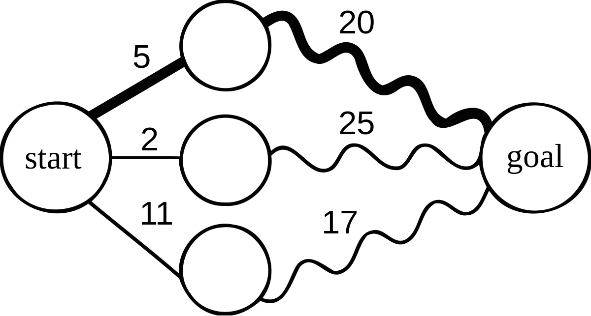
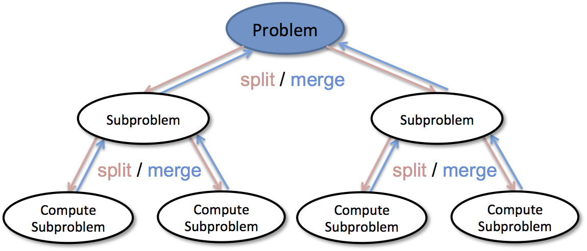
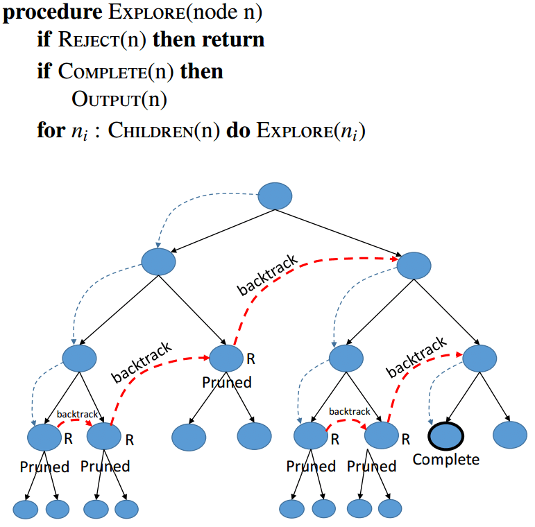

# Approaches

## Dynamic Programming

> Dynamic programming is the process of solving subproblems, then combining the solutions of the subproblems to obtain an overall solution.



Key idea: 把子问题解决后存下结果，并在后面其余子问题的解决时使用这些结果。以避免对overlap的子问题的反复计算

比如斐波拉契数列，可以用递归$f(n)=f(n-1)+f(n-2)$

也可以用DP，记录下前面子问题的结果，解决后面的子问题的时候就用前面记录的结果

```java
public static long fib(long n) {
    long f0 = 0;
    long f1 = 1;
    long f2 = 1;

    if (n == 0)
        return f0;
    else if (n == 1)
        return f1;
    else if (n == 2)
        return f2;

    for (long i = 3; i <= n; i++) {
        f0 = f1;
        f1 = f2;
        f2 = f0 + f1;
    }

    return f2;
}
```

---

又比如判断一个数是否为质数，除了一个个暴力取余数去找，也可以使用DP，利用之前存着的算出来的结果，来做后面的判断。

原理主要是，如果有一个数$i$，满足$i=pq$，其中$p\leq q$且$p$为质数，那么$i$就不是一个质数。这个$p$必须为质数，如果不是质数，那么就会有一个比$p$更小的质数满足条件（$p$不是质数的话，就可以被分解质因数）

```java
public class EfficientPrimeNumbers {
    public static void main(String[] args) {
        final int NUMBER_PER_LINE = 10;
        int current = 2;
        int squareRoot = 1;
        int count = 0;
        List<Integer> list = new ArrayList<>();

        int to;
        try (Scanner input = new Scanner(System.in)) {
            System.out.print("From 2 to ?: ");
            to = input.nextInt();
        }

        while (current <= to) {
            if (squareRoot * squareRoot < current) squareRoot++;

            boolean isPrime = true;
            for (int i = 0; i < list.size() && list.get(i) <= squareRoot; i++) {
                if (current % list.get(i) == 0) {
                    isPrime = false;
                    break;
                }
            }

            if (isPrime) {
                list.add(current);
                count++;
                System.out.printf("%10d", current);
                if (count % NUMBER_PER_LINE == 0) {
                    System.out.println();
                }
            }

            current++;
        }

        System.out.println("\nThere are " + count + " prime number(s) in the range from 2 to " + to);
    }
}
```

## Divide-and-Conquer

> The divide-and-conquer approach divides the problems into subproblems, solves the subproblems, and then combines the solutions of the subproblems to obtain the solution for the entire problem.

这个叫做分治法。其中用到了递归(用于切割问题?)，但是分治并不会导致redundant的计算(重复计算如递归法计算斐波拉契数列)。



简单地例子，使用这个来算出数组里头的最小数。

```java
public class Example {
    private static int min(int[] arr, int low, int high) {
        if (high == low) {
            return arr[low];
        }
        if (high - low == 1) {
            return Math.min(arr[low], arr[high]);
        }

        int mid = (low + high) / 2;
        int minL = min(arr, low, mid);
        int minR = min(arr, mid + 1, high);

        return Math.min(minL, minR);
    }

    public static void main(String[] args) {
        int[] arr = {19, 1, 9, 8, 10};
        System.out.println(min(arr, 0, arr.length - 1)); // 1
    }
}
```

## Backtracking

> The backtracking approach searches for a candidate solution incrementally, abandoning the option as soon as it determines the candidate cannot possibly be a valid solution, then looks for a new candidate.

回溯法，记录好当前的步，向前进一步做尝试，如果不行就往回退，寻找下一个可能。



比如常见的有八皇后问题

```java
import java.util.Arrays;

public class EightQueenBacktracking {
    final static int SIZE = 8;
    final static int[] queen = new int[SIZE];

    public static void main(String[] args) {
        Arrays.fill(queen, -1);
        if (search()) {
            System.out.println(Arrays.toString(queen));
        }
    }

    private static boolean search() {
        int row = 0;
        while (row >= 0 && row < SIZE) {
            int find = find(row);
            if (find < 0) {
                queen[row] = -1;
                row--;
            } else {
                queen[row] = find;
                row++;
            }
        }

        return row != -1;
    }

    private static int find(int row) {
        // memorization
        for (int i = queen[row] + 1; i < SIZE; i++) {
            if (isValid(row, i)) {
                return i;
            }
        }

        return -1;
    }

    private static boolean isValid(int row, int col) {
        // traverse the array to check the problem
        for (int i = 0; i < row; i++) {
            // the same column, up-left and up-right from current queen
            if (queen[i] == col || queen[i] == col - (row - i) || queen[i] == col + (row - i)) {
                return false;
            }
        }

        return true;
    }
}
```

如图所示


