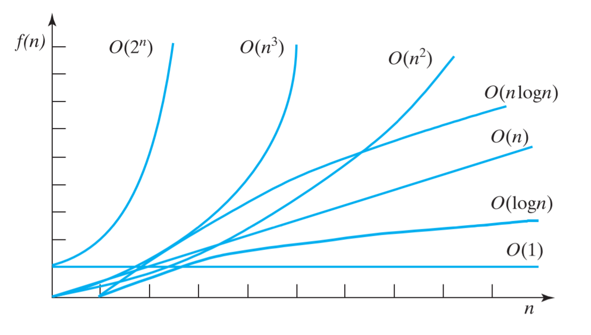
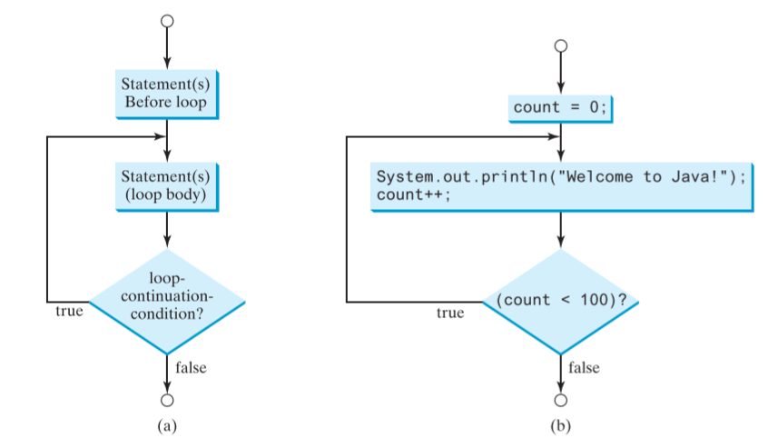

# 基础储备

[[toc]]

## Big O Notion

大O表示法可以用来表示时间复杂度和空间复杂度

Big O means "order of magnitude"(数量级)

> The big O notion estimates the execution time of an algorithm in relation to input size.

即程序**执行时间**与**输入规模**的**关系**，表示算法的时间复杂度。

比如从n个元素的数组中**逐个地**搜索一个元素，最坏的情况就是需要耗时n，而搜索2n个元素的话最坏情况是耗时2n。可以看出，随着输入规模线性增长，执行时间也呈现**线性**增长。因此复杂度是$O(n)$。

这个算法的输入规模$n$和执行时间$f(n)$的关系如下表格，很容易得出$f(n)=n$。

对比运行时间与输入规模之间的关系，就能得出大O了。

下表也体现了，执行次数的多少（$f(n)=n,f(n)=n/2,f(n)=100n$）并不会影响执行时间的增长率。所以一般来说，算出最坏情况下的执行时间与输入规模关系的表达式，剃掉系数。用$O(n)$表示就行了


常时间--如果一个算法的执行时间不随着输入规模的变化而变化，那么就是`constant time`。即$O(1)$

忽略关系中的非主要的部分--比如$T(n)=n^3+2n+1$，这个时间复杂度就是$O(n^3)$

> 举例$T(n)=n^3+n$：当n -> 100n时，变化主要是由$n^3$贡献的，而低次的$n$对变化的贡献可以忽略不计。时间复杂度就是$O(n^3)$

计算大O的时候，常用的是**最坏情况**或平均情况。

除此之外，大O表示法还可以用来表示空间复杂度

## Complexity

$T(n)$的不同，就有了不同的复杂度，把不同的函数$T(n)$画在同一个坐标轴上，如下



增长的快慢有如下

$$O(1)<O(logn)<O(n)<O(n logn)<O(n^2)<(O^3)<O(2^n)$$

## Loop flow

虽然不知道发生了什么，但是还有人不知道while和for的关系？

其实for loop可以说，是从while loop那里来的而已。while是基本。

``` java
for (int i = 0; i < n; i++) {
    // do sth
}
```

等效于

``` java
int i = 0;
while (i < n) {
    // do sth
    i++;
}
```

然后do-while只是while中的判断语句的执行位置改变，导致loop body里的语句必被至少执行一次而已。（执行次数大于1的话，此时do-while与while就是完全一致了）

得把它们的control flow贴上来，循环次数可不能错掉啊

- while loop


- do-while loop



- for loop


## Determining Big O

可以使用上面的知识来确定大O，比较好训练的操作就是分析循环了。

简的来说就是：算出$T(n)$的表达式

``` java
for (int i = 1; i <= n; i++) {
    k = k + 5;
}
```

这是一个简单的循环。首先，执行`k = k + 5`耗时固定，是constant time，记作$c$，因此，每执行一次耗时$c$。

又因为这个循环执行n次，所以得出输入规模与执行时间的函数表达式为

$$T(n)=c*n=O(n)$$

``` java
for (int i = 1; i <= n; i++) {
    for (int i = 1; i <= n; i++) {
        k = k + 5;
    }
}
```

一个简单的nest-loop。由上面的分析，很容易得到。

$$T(n)=c*n*n=O(n^2)$$

``` java
for (int i = 1; i <= n; i++) {
    for (int j = 1; j <= i; j++) {
        k += 5;
    }
}
```

同样是一个嵌套循环，只不过里面的循环结束条件变了，随着i的变化而变化。此时照样可以分析得到

$$T(n)=c*(1+2+3+...+n)=c*\frac{n(n+1)}{2}=O(n^2)$$

``` java
if (list.contains(e)) {
    System.out.println(e);
} else {
    for (var e : list) {
        System.out.println(e);
    }
}
```

上面是一个条件判断的代码块，此时时间复杂度的计算就是：计算if做判断所需的时间，加上两个分支中的最最坏情况所需的时间。

`T(n)=if test time + worst-case time(if clause, else clause)`

$$T(n)=O(n)+O(n)=O(n)$$

``` java
long result = 1;
for (int i = 1; i <= n; i++) {
    result *= a;
}
// or
long result = a;
for (int i = 1; i <= k; i++) {
    result = result * result;
}
```

计算一个指数运算$a^n$的结果有两种操作。

前者要跑$n$次`result *= a`，即$2*2*2*...*2$。后者只需要跑$log_{2}n$次`result = result * result`，即$((2^n)^n)^n...)^n$

|n(in $a^n$)|方法1的$T(n)$|方法2的$T(n)$
|--|--|--
|1|1|0
|2|2|1
|4|4|2
|8|8|3
|16|16|4
|32|32|5
|...|...|...
|$n$|$n$|$log_{2}n$

由表格，前者的时间复杂度就是$O(n)$，后者的是$O(log n)$，这个就是对数时间复杂度了。

## Recurrence relation

递推关系式，形如$f(x)=f(x-1)+f(x-2)$这样的表达式

举个例子，选择排序

``` java
private static void sort(int[] array) {
    for (int i = 0; i < array.length - 1; i++) {
        int currentMin = array[i];
        int currentMinIndex = i;

        for (int j = i + 1; j < array.length; j++) {
            if (array[j] < currentMin) {
                currentMin = array[j];
                currentMinIndex = j;
            }
        }

        if (currentMin != array[i]) {
            array[currentMinIndex] = array[i];
            array[i] = currentMin;
        }
    }
}
```

容易看出：让第n个元素与后面的元素比较的用时，第一次是n-1次比较，第二次就是n-2次...还有赋值交换的用时c

$$T(n)=k(n-1)+c+k(n-2)+c+...+k+c$$
$$=k\frac{(n-1)n}{2}+c(n-1)$$
$$=k(\frac{n^2}{2}-\frac{n}{2})+cn-c$$
$$=O(n^2)$$

上面选择排序的应该是

$$T(n)=T(n-1)+k(n-1)+c,n\geq 1$$

其中除了函数外多出来的那一坨$k(n-1)+c$，就是用大O表示的那部分了，此处的表示为$O(n)$，如下

$$T(n)=T(n-1)+O(n),n\geq 1$$

一些常见算法的推导式如下


