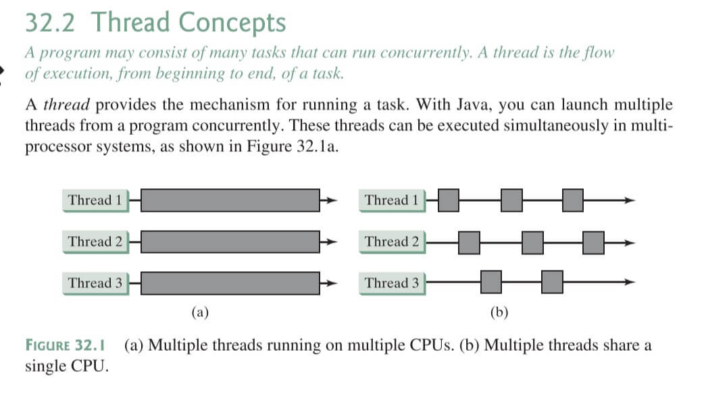
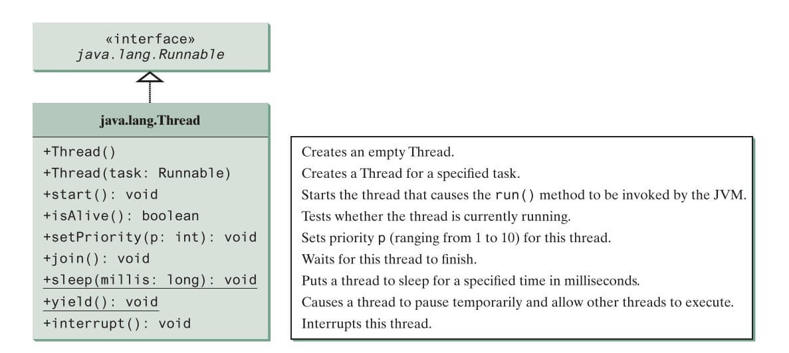
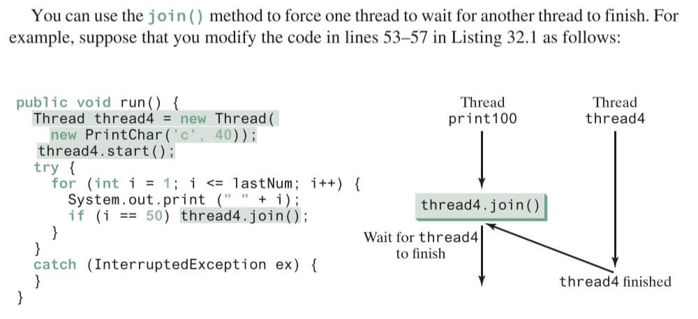
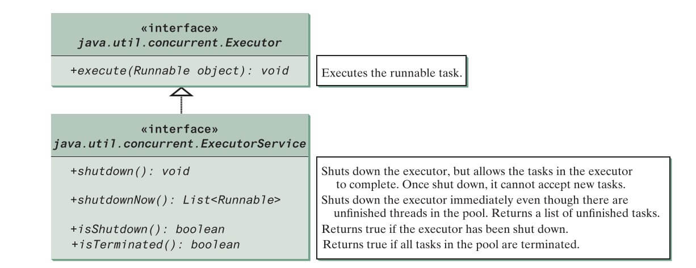
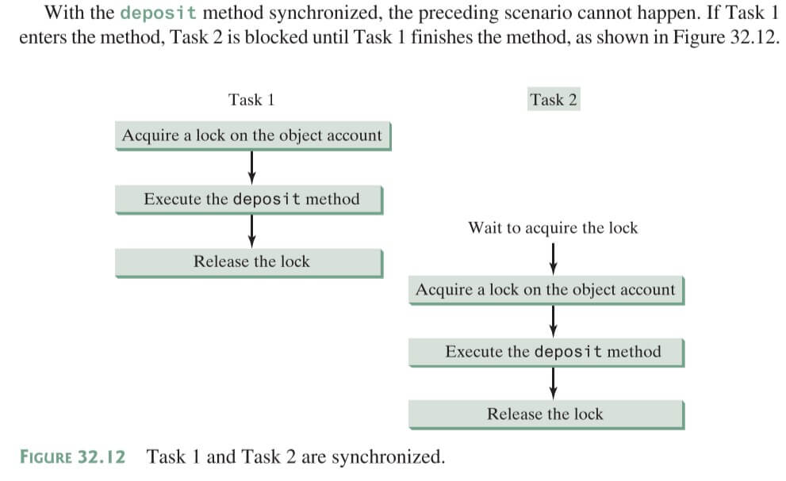
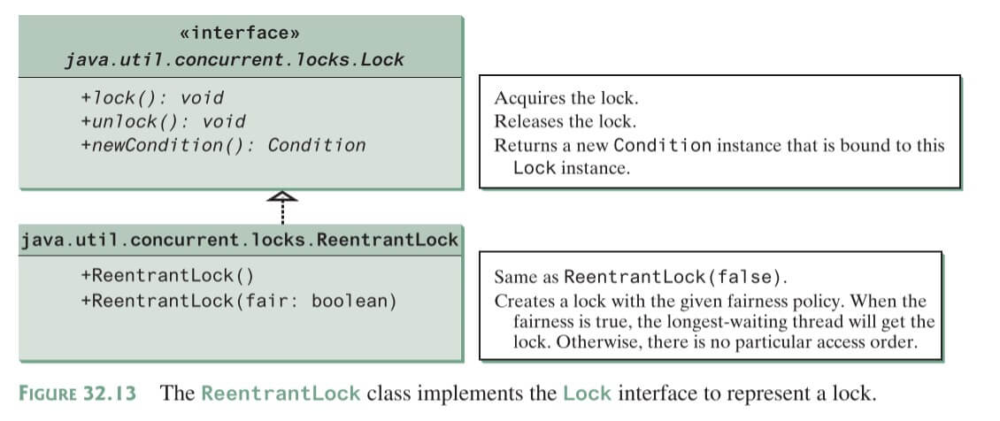
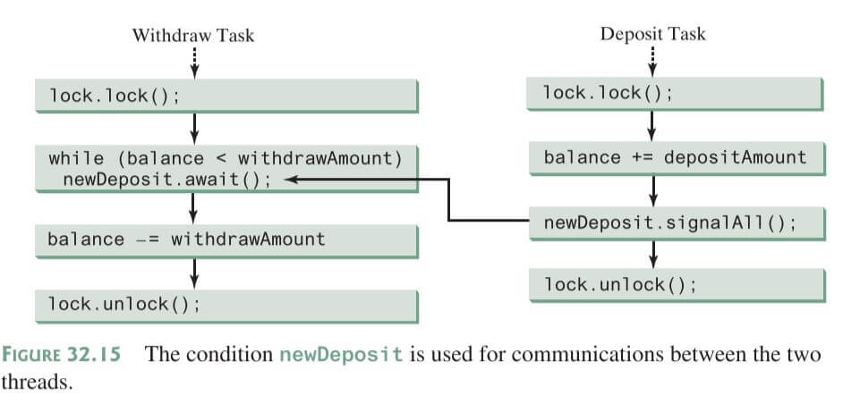
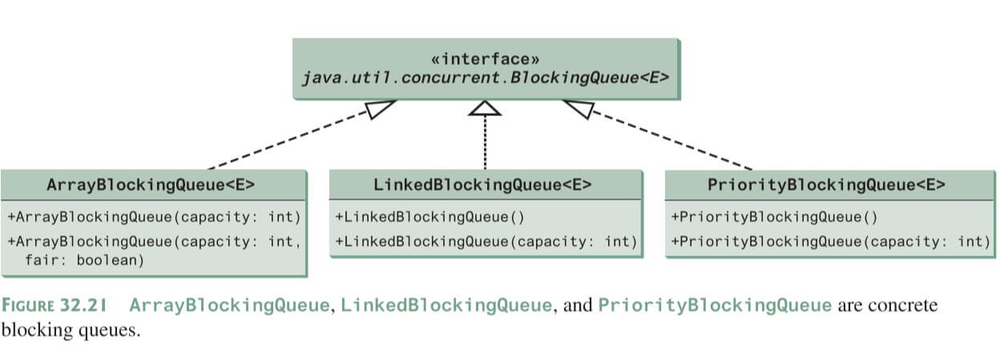
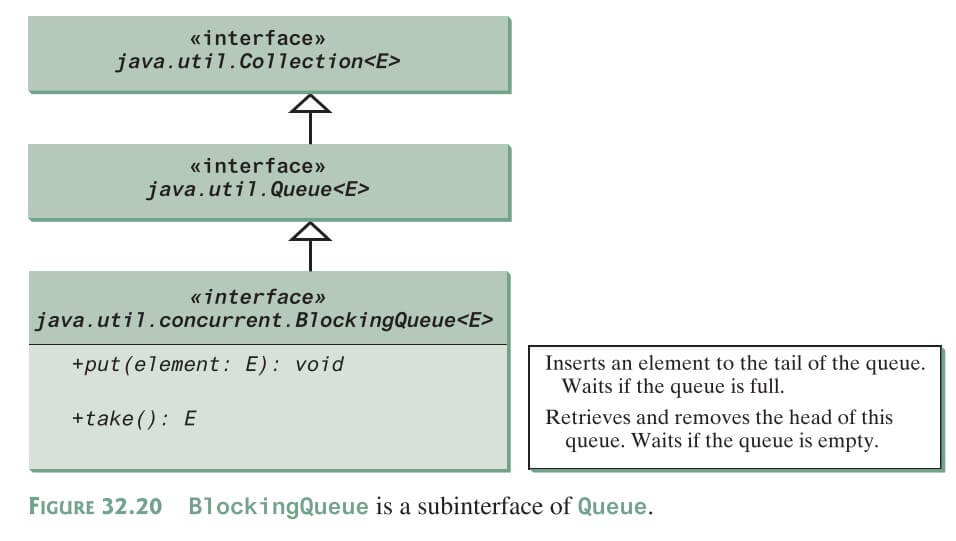
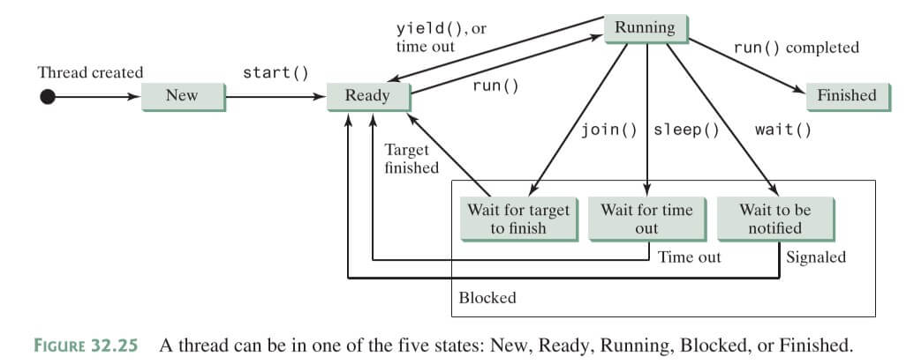

# MultiThreading

这是用来记录Java多线程编程相关内容的

线程是什么呢？我觉得可以这样来表述吧：一个Program变成Process之后，系统分配了一定的资源。在一个process里头，可以有一或多个Thread即线程在里头跑。

那么实际运行的时候，多条线程之间，是怎么跑起来的呢？如图


线程这些东西一般都要在操作系统课程里面再深入学习了吧，那下面就开始记录java里面的多线程编程的基础概念了

## 新建Thread与Task

Java中有一个interface叫做Runnable，顾名思义就是用来表示Thread要执行的任务。而传入一个Runnable进入Thread，Thread在`start()`或者`run()`的时候就会invoke这个Runnable里面对应的`run()`方法啦。

我们可以新建一个Runnable然后在其里头Override掉run()这个方法，也可以创建一个实现这个接口的类，更有甚者，还可以直接extend于Thread类（不推荐这个做法）

Thread类里头有一些方法要有个印象，也要对这个类里面一些Deprecated的方法进行规避，并了解原因。



//TODO:为什么有一些方法如`stop()`被Deprecate了呢？

对了，对于多线程编程，我觉得画图是一个挺好的方法，直接画几条线表示线程，有下面一些图还是挺实用的



然后我用的教程的32.5小节就以jfx来示范了在特定线程下所执行的特定方法。（这跟安卓开发的UI thread有着异曲同工）（这个就不摘抄了，直接看书就行）

## 线程池

线程池的英语是`Thread pool`，顾名思义就是有一堆线程在里头的一个池子，我们可以用它来分配线程给不同的Task。



## 线程同步

多个线程同时操作一个数据，很容易使得这个数据corrupted（数据腐败？）
这个是使用了一个经典例子：银行存款或者是生产者消费者关系来举例。

```java
package chapter32;

import java.util.concurrent.*;

public class AccountWithoutSync {
    private static final Account account = new Account();

    public static void main(String[] args) {
        ExecutorService executor = Executors.newCachedThreadPool();

        // Create and launch 100 threads
        for (int i = 0; i < 100; i++) {
            executor.execute(new AddAPennyTask());
        }

        executor.shutdown();

        // Wait until all tasks are finished
        while (!executor.isTerminated()) {
        }

        System.out.println("What is balance? " + account.getBalance());
    }

    // A thread for adding a penny to the account
    private static class AddAPennyTask implements Runnable {
        public void run() {
            account.deposit(1);
        }
    }

    // An inner class for account
    private static class Account {
        private int balance = 0;

        public int getBalance() {
            return balance;
        }

        public void deposit(int amount) {
            int newBalance = balance + amount;
            //balance += amount;

            // This delay is deliberately added to magnify the
            // data-corruption problem and make it easy to see.
            try {
                Thread.sleep(5);
            }
            catch (InterruptedException ignored) {
            }

            balance = newBalance;
        }
    }
}
```

其实上面的这段代码可能有如下的运行情况


这种情况呢就是所谓的线程不安全啦，这个安全不安全的词语经常有见到，所以还是要了解一下的。(摘抄自原文)
`Obviously, the problem is that Task 1 and Task 2 are accessing a common resource in a way that causes a conflict. This is a common problem, known as a race condition, in multithreaded programs. A class is said to be thread-safe if an object of the class does not cause a race condition in the presence of multiple threads. As demonstrated in the preced-
ing example, the Account class is not thread-safe.`

所以为了解决同时跑同一个代码块的情况，我们可以给他加上一个关键字`synchronized`来使一块代码或类线程同步。如下

```java
public synchronized void deposit(int amount)
```

代码运行起来就会像这样子了，实际原理是给对象配了把锁。只有拿到锁的线程才能对这个对象的对象方法进行访问（这句话可以理解为每个对象都有自己的唯一的一把锁，而这个锁可以apply在实例方法或者static方法上的）

结合上下文就可以知道，一个线程要想进入这块代码区域，就要拿下面代码的`expr`的锁，这锁没被其他线程拿走就自己拿了开始执行，执行完之后再释放。反之，就要等拿了锁的线程释放这把锁。

使用是像下面这样子

```java
synchronized (expr) {
    statements;
}
```

这里的expr其实就是对象引用，`account`在这里就是指的class Account（实例锁）（也可以填入Account.class（类锁）或者this（this用的时候你要确定这个this指的是谁）)，也就是说account对象运行到这里的时候，都要拿锁，如果锁被其他同类拿了，就要等同类把lock给release掉

但是，`synchronized`只是方便了我们的使用，其实这个线程同步的实质就是加了lock嘛，java里头也有Lock这个类，我们可以直接使用它。（前面的`synchronized`利用的是类或者一个对象上的锁，而这个类是直接新创建了一个Lock对象，这个对象实际就是一把锁）


怎么用呢，先实例化一个static的Lock，然后在想要线程同步的代码块前后使用即可

```java
private static Lock lock = new ReentrantLock(); // Create a lock

lock.lock(); // Acquire the lock
try {
    int newBalance = balance + amount;

    // This delay is deliberately added to magnify the
    // data-corruption problem and make it easy to see.
    Thread.sleep(5);

    balance = newBalance;
}
catch (InterruptedException ex) {
}
finally {
    lock.unlock(); // Release the lock
}
```

## 线程协助

这里不讲位置了，主要是笔记，自己看的懂就行了。await()是让这条线程放掉锁，然后idle在那个代码处，等待其他地方传来的`signal`即是其他线程调用了`signal() signalAll()`


英语就是Thread cooperate了吧，也可以叫做Thread coordinate

就是从Lock对象里调用方法`newCondition()`来获得一个对应Lock对象的Condition

下面是一个取款存款的操作，取款的话当然是不能透支啊，所以我们可以在取款和存款的两条线程里头，加入一个`newDeposit`条件来进行线程之间的沟通合作。


详细的实现代码，请翻书到32.9小节那里。

## Blocking Queue

其实从刚刚的Condition那里，如果我们要判断一个队列是否满或空来控制存入取出的线程，就可以使用Condition来控制了。但，jvav官方就给了一些现成的东西。


其实是从Collection Framework那边延伸出来的，只不过多了一些自己特有的method罢了。


(...说白了就是一个容量有限的队列而已...)

## Semaphores

这翻译过来叫做信号塔...?算了还是用英语顶住吧。这个跟Lock是几乎一致的，但是它可以允许多个线程拿到锁进入（1~n个）。

```java
private static Semaphore semaphore = new Semaphore(1)
public void deposit(int amount) { 
    try {
        semaphore.acquire();
        //codes
    } catch (InterruptedException ex) {

    } finally {
        semaphore.release();
    }
}
```

## 死锁

emm这个可以像学校的计算机导论说的进程要文件资源那样理解，（换个无非就是线程想要锁嘛

## 线程的状态

线程的状态大概可以分为五种吧：**New Ready Running Blocked Finished**

先是一张图


然后是解释

> Tasks are executed in threads. Threads can be in one of the five states: New, Ready, Running, Blocked, or Finished (see Figure 32.25).
>
> When a thread is newly created, it enters the New state. After a thread is started by calling its start() method, it enters the Ready state. A ready thread is runnable but may not be running yet. The operating system has to allocate CPU time to it.
>
> When a ready thread begins executing, it enters the Running state. A running thread can enter the Ready state if its given CPU time expires or its yield() method is called.
>
> A thread can enter the Blocked state (i.e., become inactive) for several reasons. It may have invoked the join(), sleep(), or wait() method. It may be waiting for an I/O operation to finish. A blocked thread may be reactivated when the action inactivating it is reversed. For example, if a thread has been put to sleep and the sleep time has expired, the thread is reactivated and enters the Ready state.
> Finally, a thread is Finished if it completes the execution of its run() method.
>
> The isAlive() method is used to find out the state of a thread. It returns true if a thread is in the Ready, Blocked, or Running state; it returns false if a thread is new and has not started or if it is finished.
>
> The interrupt() method interrupts a thread in the following way: If a thread is currently in the Ready or Running state, its interrupted flag is set; if a thread is currently blocked, it is awakened and enters the Ready state, and a java.lang.InterruptedException is
thrown.
