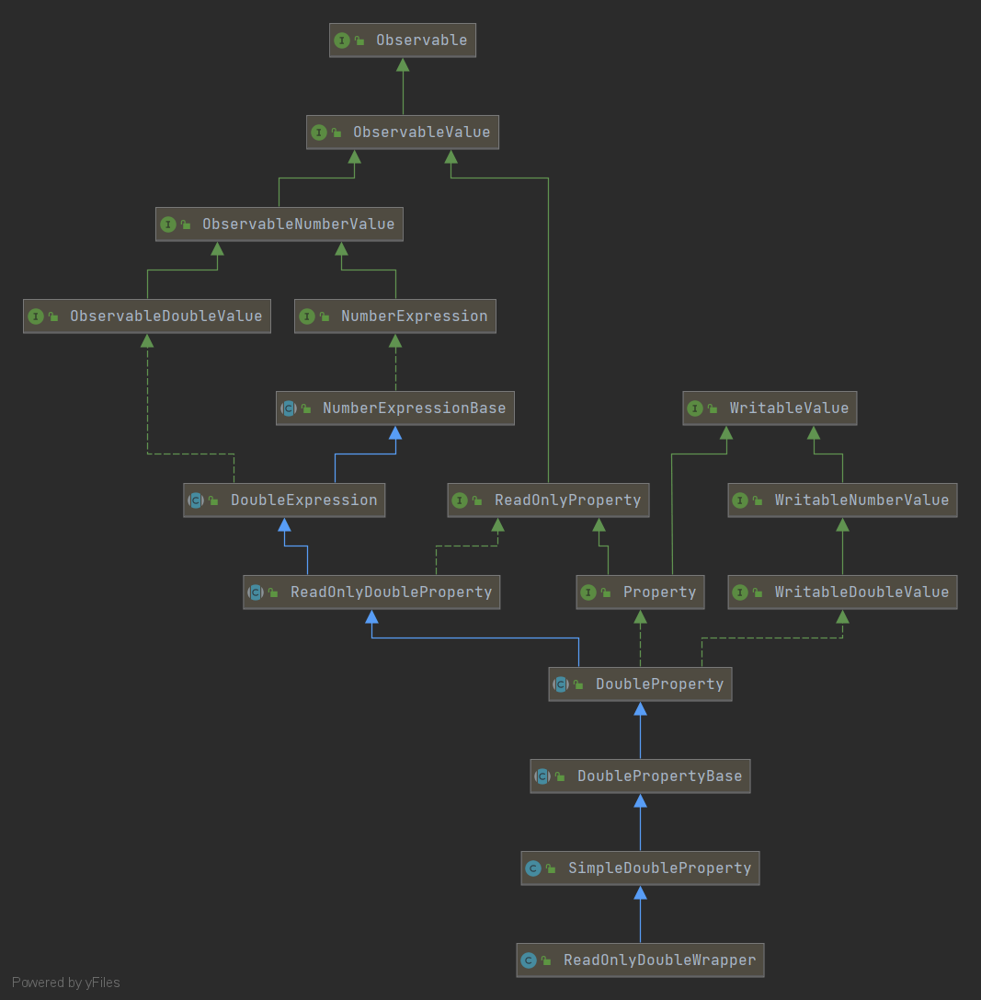
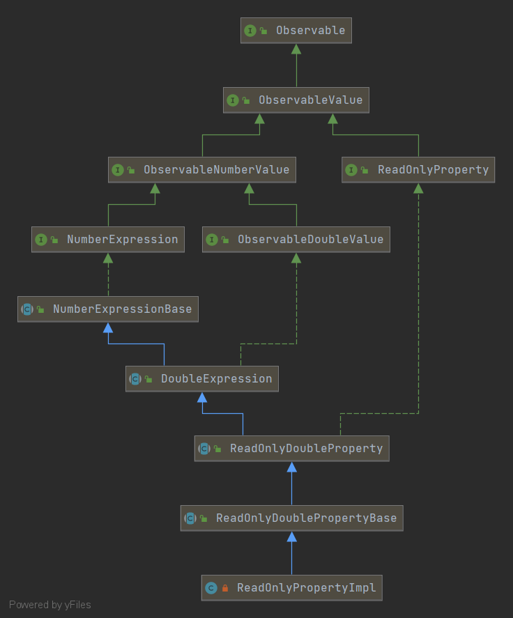

# 设计模式

## Observer Pattern(JavaFX)

本文中的JavaFX版本号为`11.0.9`

### 写在前面

最近的军训真的又干燥又冷，我感到十分不舒服。不过军训的中午，拥有长达两个钟的吃饭与休息时间。闲来无事，我就捡起了好两个星期没有接触的Java（这两个星期游戏+复习+发烧，时间都没耗光了）

那么言归正传，之前我学了并会在一些简单的实际应用中使用Java的OOP，并了解到了一些设计模式。最近又想了解一下Observer Pattern（观察者模式），那么我能否通过阅读我所熟练使用的JavaFX源码来了解这个设计模式呢？

### 上手之前

“知己知彼，百战百胜。”这句话还是一样重要，所以我先去找了下观察者模式的解释。

> 定义对象间的一种一对多的依赖关系，当一个对象的状态发生改变时，所有依赖于它的对象都得到通知并被自动更新。

通俗地讲，就是对象在更新的时候，顺便通知其他对象，从而使得其他对象得到更新？

我写了一段使用JavaFX代码，运行后，窗口中的宽度与高度大小信息都会随着窗体的大小变化而更新。如下

``` java
import javafx.application.Application;
import javafx.beans.InvalidationListener;
import javafx.beans.Observable;
import javafx.beans.property.ReadOnlyDoubleProperty;
import javafx.geometry.Pos;
import javafx.scene.Scene;
import javafx.scene.layout.VBox;
import javafx.scene.text.Text;
import javafx.stage.Stage;

public class JavaFXBinding extends Application {
    @Override
    public void start(Stage primaryStage) throws Exception {
        VBox pane = new VBox(5);
        Text textWidth = new Text();
        Text textHeight = new Text();
        pane.getChildren().addAll(textHeight, textWidth);
        pane.setAlignment(Pos.CENTER);

        //set invalidation listener
        primaryStage.widthProperty().addListener(new InvalidationListener() {
            @Override
            public void invalidated(Observable observable) {
                String width = String.format("Width: %.2f", ((ReadOnlyDoubleProperty)observable).get());
                textHeight.setText(width);
            }
        });
        primaryStage.heightProperty().addListener(new InvalidationListener() {
            @Override
            public void invalidated(Observable observable) {
                String height = String.format("Height: %.2f", ((ReadOnlyDoubleProperty)observable).get());
                textWidth.setText(height);
            }
        });

        Scene scene = new Scene(pane);
        primaryStage.setTitle("TEST");
        primaryStage.setScene(scene);
        primaryStage.show();
    }
}
```

并且有使用IDEA IDE

### 开始胡乱分析

可以看出，窗口里头`Text`的字符串变换是通过这一段代码实现的。这里以Width（窗体宽度）来说。

``` java
primaryStage.widthProperty().addListener(new InvalidationListener() {
    @Override
    public void invalidated(Observable observable) {
        String width = String.format("Width: %.2f", ((ReadOnlyDoubleProperty)observable).get());
        textHeight.setText(width);
    }
});
```

从这段代码来看，应该是通过invoke `widthProperty()`来获取`primaryStage`这个对象里头的`ReadOnlyDoubleProperty`宽度width，然后对其invoke `addListener(javafx.beans.InvalidationListener listener)`方法来添加listener。

那我们先跳转到`primaryStage`这个对象的`widthProperty()`方法所在位置。

我们在`javafx.stage.Windows`类下发现了这个，并根据上下文，再复制了其他的片段，如下所示。

``` java
private ReadOnlyDoubleWrapper width = new ReadOnlyDoubleWrapper(this, "width", Double.NaN);

public final ReadOnlyDoubleProperty widthProperty() { 
    return width.getReadOnlyProperty(); 
}
```

这里出现了不同的两个类型，并且里面涉及到的方法又去到了其他的类，查了一下jfx的文档，发现了类之间的继承关系如下。

``` text
Class ReadOnlyDoubleWrapper
java.lang.Object
javafx.beans.binding.NumberExpressionBase
javafx.beans.binding.DoubleExpression
javafx.beans.property.ReadOnlyDoubleProperty
javafx.beans.property.DoubleProperty
javafx.beans.property.DoublePropertyBase
javafx.beans.property.SimpleDoubleProperty
javafx.beans.property.ReadOnlyDoubleWrapper

All Implemented Interfaces:
NumberExpression, Observable, Property<Number>, ReadOnlyProperty<Number>, ObservableDoubleValue, ObservableNumberValue, ObservableValue<Number>, WritableDoubleValue, WritableNumberValue, WritableValue<Number>

public abstract class ReadOnlyDoubleProperty extends DoubleExpression implements ReadOnlyProperty<Number>
public class ReadOnlyDoubleWrapper extends SimpleDoubleProperty
```



由上可见，`ReadOnlyDoubleProperty`是一个抽象类，而`ReadOnlyDoubleWrapper`是一个concrete的实实在在的类。通过下面的分析可以查出，一个`ReadOnlyDoubleWrapper`是如何被construct的。

我们首先在`ReadOnlyDoubleWrapper`的constructor里头发现了`with-arg`的`super()`，也就是说它显示地invoke了父类的constructor。父类里的constructor也是如此的操作，直到来到了类`DoublePropertyBase`才停了下来。

``` java
//class ReadOnlyDoubleWrapper
public ReadOnlyDoubleWrapper(Object bean, String name,
        double initialValue) {
    super(bean, name, initialValue);
}

//class SimpleDoubleProperty
public SimpleDoubleProperty(Object bean, String name, double initialValue) {
    super(initialValue);
    this.bean = bean;
    this.name = (name == null) ? DEFAULT_NAME : name;
}
//class DoublePropertyBase
public DoublePropertyBase(double initialValue) {
    this.value = initialValue;
}
```

那么，最后返回的是个什么对象？仔细地查看了一下如下的代码，发现这是通过一个私有类`ReadOnlyPropertyImpl`将一个可写的property转化为了一个只读的property

``` java
private ReadOnlyPropertyImpl readOnlyProperty;

public ReadOnlyDoubleProperty getReadOnlyProperty() {
    if (readOnlyProperty == null) {
        readOnlyProperty = new ReadOnlyPropertyImpl();
    }
    return readOnlyProperty;
}

private class ReadOnlyPropertyImpl extends ReadOnlyDoublePropertyBase {

    @Override
    public double get() {
        return ReadOnlyDoubleWrapper.this.get();
    }

    @Override
    public Object getBean() {
        return ReadOnlyDoubleWrapper.this.getBean();
    }

    @Override
    public String getName() {
        return ReadOnlyDoubleWrapper.this.getName();
    }
};
```

这个私有类的继承关系如下，为了更好看，我去IDEA上生成了关系图

``` text
Class ReadOnlyDoublePropertyBase
java.lang.Object
javafx.beans.binding.NumberExpressionBase
javafx.beans.binding.DoubleExpression
javafx.beans.property.ReadOnlyDoubleProperty
javafx.beans.property.ReadOnlyDoublePropertyBase
javafx.beans.property.ReadOnlyDoubleWrapper.ReadOnlyPropertyImpl

All Implemented Interfaces:
NumberExpression, Observable, ReadOnlyProperty<Number>, ObservableDoubleValue, ObservableNumberValue, ObservableValue<Number>
```



啊，因为在Stage里头的width需要更改，所以要是个可读可写的property。但可以用一个内部私有类，把一个property肛成一个read-only property。并根据dynamic binding将`ObservableDoubleValue`和`ReadOnlyProperty`里头的方法给实现掉（原先是在类`DoublePropertyBase`和`SimpleDoubleProperty`里头实现的）。实在是妙！

并且查阅文档可以发现内部私有类`ReadOnlyPropertyImpl`与Listener有关的方法，全部在`ReadOnlyDoublePropertyBase`类里头。

所以我们要看`addListener`的实现，就要去`DoublePropertyBase`这个类里头看了。如下所示

``` java
ExpressionHelper<Number> helper;
@Override
public void addListener(InvalidationListener listener) {
    helper = ExpressionHelper.addListener(helper, this, listener);
}
```

az，里面竟然还有一个`ExpressionHelper`？？？不管是马是驴，先溜出来看看。看起来这个`ExpressionHelper`是个抽象类，提供了许多abstract方法，然后由这个抽象类里头concrete的私有内部类实现。调用这个类里面的东西，经过阅读，其实几乎都是从static方法里头把value pass进去处理的。

选择性地抽出`ExpressionHelper`的部分代码。

``` java
protected final ObservableValue<T> observable;

private ExpressionHelper(ObservableValue<T> observable) {
    this.observable = observable;
}

public static <T> ExpressionHelper<T> addListener(ExpressionHelper<T> helper, ObservableValue<T> observable, InvalidationListener listener) {
    if ((observable == null) || (listener == null)) {
        throw new NullPointerException();
    }
    observable.getValue(); // validate observable
    return (helper == null)? new SingleInvalidation<T>(observable, listener) : helper.addListener(listener);
}

//part of the code
private static class SingleInvalidation<T> extends ExpressionHelper<T> {

    private final InvalidationListener listener;

    private SingleInvalidation(ObservableValue<T> expression, InvalidationListener listener) {
        super(expression);
        this.listener = listener;
    }

    @Override
    protected ExpressionHelper<T> addListener(InvalidationListener listener) {
        return new Generic<T>(observable, this.listener, listener);
    }
}

//part of the code
private static class Generic<T> extends ExpressionHelper<T> {

    private InvalidationListener[] invalidationListeners;
    private ChangeListener<? super T>[] changeListeners;
    private int invalidationSize;
    private int changeSize;
    private boolean locked;
    private T currentValue;

    private Generic(ObservableValue<T> observable, InvalidationListener listener0, InvalidationListener listener1) {
        super(observable);
        this.invalidationListeners = new InvalidationListener[] {listener0, listener1};
        this.invalidationSize = 2;
    }

    @Override
    protected Generic<T> addListener(InvalidationListener listener) {
        if (invalidationListeners == null) {
            invalidationListeners = new InvalidationListener[] {listener};
            invalidationSize = 1;
        } else {
            final int oldCapacity = invalidationListeners.length;
            if (locked) {
                final int newCapacity = (invalidationSize < oldCapacity)? oldCapacity : (oldCapacity * 3)/2 + 1;
                invalidationListeners = Arrays.copyOf(invalidationListeners, newCapacity);
            } else if (invalidationSize == oldCapacity) {
                invalidationSize = trim(invalidationSize, invalidationListeners);
                if (invalidationSize == oldCapacity) {
                    final int newCapacity = (oldCapacity * 3)/2 + 1;
                    invalidationListeners = Arrays.copyOf(invalidationListeners, newCapacity);
                }
            }
            invalidationListeners[invalidationSize++] = listener;
        }
        return this;
    }
}
```

根据**SingleInvalidation**的英语意思，可以猜测这个类是专门处理只有一个listener的情况的，再结合`Generic`的constructor的代码和`SingleInvalidation`中`addListener()`，在new这个对象的时候顺便也把Observable通过`super(expression);`给赋值进去了。并可以猜测，当有超过一个listener嗷嗷待哺的时候，`ExpressionHelper`中的static方法就会return一个`Generic`对象给`DoublePropertyBase`中的helper对象。也就是说，所有的listener都被保存在了property对象的helper对象里头。

那么，言归正传，到底property的value变化是怎么样让listener们知道的呢？

那么，在这个例子里头，width property的更改，是随着窗体大小的更改而更改的。那么我猜测可以通过看`javafx.stage.Windows`里头的方法来找到根源。

``` java
public final void setWidth(double value) {
    width.set(value);
    peerBoundsConfigurator.setWindowWidth(value);
    widthExplicit = true;
}
```

可以看出，这个width是通过`set(double value)`方法更改值的。通过IDE强大的定位功能，我一番小操作，就来到了`DoublePropertyBase`里头，找到了这么点代码

``` java
@Override
public void set(double newValue) {
    if (isBound()) {
        throw new java.lang.RuntimeException((getBean() != null && getName() != null ?
                getBean().getClass().getSimpleName() + "." + getName() + " : ": "") + "A bound value cannot be set.");
    }
    if (value != newValue) {
        value = newValue;
        markInvalid();
    }
}

private void markInvalid() {
    if (valid) {
        valid = false;
        invalidated();
        fireValueChangedEvent();
    }
}
```

但是，我们做出监听的对象是`ReadOnlyDoubleWrapper`啊，那么怎么就只定位到了`DoublePropertyBase`呢？大脑告诉我，IDE不是万能的，只是我自己太菜导致万万不能而已。回想刚刚上面记录的继承关系图和`width`的实际类型，我顺藤摸瓜，来到了`ReadOnlyDoubleWrapper`，果不其然，找到了Override的方法

``` java
private ReadOnlyPropertyImpl readOnlyProperty;

@Override
protected void fireValueChangedEvent() {
    super.fireValueChangedEvent();
    if (readOnlyProperty != null) {
        readOnlyProperty.fireValueChangedEvent();
    }
}
```

又根据`ReadOnlyDoubleWrapper`的继承关系图，我找到了。`ReadOnlyDoublePropertyBase`里头的这个方法的确是被调用了。

``` java
protected void fireValueChangedEvent() {
    ExpressionHelper.fireValueChangedEvent(helper);
}
```

来到这里，就已经稳得一笔了，我们只需要定位到`ReadOnlyDoublePropertyBase`里头的helper实际所属的类，找到`fireValueChangedEvent()`方法即可

``` java
//ExpressionHelper (Part)
public static <T> void fireValueChangedEvent(ExpressionHelper<T> helper) {
    if (helper != null) {
        helper.fireValueChangedEvent();
    }
}

//SingleInvalidator (Part)
protected final ObservableValue<T> observable;

@Override
protected void fireValueChangedEvent() {
    try {
        listener.invalidated(observable);
    } catch (Exception e) {
        Thread.currentThread().getUncaughtExceptionHandler().uncaughtException(Thread.currentThread(), e);
    }
}

//Generic (Part)
private static class Generic<T> extends ExpressionHelper<T> {
    private InvalidationListener[] invalidationListeners;
    private ChangeListener<? super T>[] changeListeners;
    private int invalidationSize;
    private int changeSize;
    private boolean locked;
    private T currentValue;

    @Override
    protected void fireValueChangedEvent() {
        final InvalidationListener[] curInvalidationList = invalidationListeners;
        final int curInvalidationSize = invalidationSize;
        final ChangeListener<? super T>[] curChangeList = changeListeners;
        final int curChangeSize = changeSize;

        try {
            locked = true;
            for (int i = 0; i < curInvalidationSize; i++) {
                try {
                    curInvalidationList[i].invalidated(observable);
                } catch (Exception e) {
                    Thread.currentThread().getUncaughtExceptionHandler().uncaughtException(Thread.currentThread(), e);
                }
            }
            if (curChangeSize > 0) {
                final T oldValue = currentValue;
                currentValue = observable.getValue();
                final boolean changed = (currentValue == null)? (oldValue != null) : !currentValue.equals(oldValue);
                if (changed) {
                    for (int i = 0; i < curChangeSize; i++) {
                        try {
                            curChangeList[i].changed(observable, oldValue, currentValue);
                        } catch (Exception e) {
                            Thread.currentThread().getUncaughtExceptionHandler().uncaughtException(Thread.currentThread(), e);
                        }
                    }
                }
            }
        } finally {
            locked = false;
        }
    }
}
```

从`SingleInvalidation`中的`fireValueChangedEvent()`中可以看出，直接对已经实现了的`InvalidationListener`进行方法invoke，如果是一个以上的话，就是for循环分别调用不同`InvalidationListener`的`invalidated()`方法，其中还有一些其他的判断，跟这里暂时没啥关系，先不提。

那么，做出了推理之后，是不是要Debug验证一下呢？于是我在IDE中，给这里下了个Breakpoint

``` java
//ReadOnlyDoublePropertyBase
ExpressionHelper.fireValueChangedEvent(helper);//breakpoint here
```

从Frame来看，我的思路被验证了，是正确的


### 亲手试错

竟然不明不白地就这样分析了一通InvalidationListener的实现，对Observer Pattern也有了更进一步的了解。于是垃圾地模拟了一下好像现实的场景：有一个商店里面有商品要抢购，而顾客们迫切地想知道商品的补货信息。但是，你是一个Customer，而不一定是一个Subscriber。

思路就是，实现一个Subscription接口，然后由Customer实现，最后Store里头存储着subscribers，并会提醒subscriber们关于价格和库存的更新。

``` java
package test;

import java.util.ArrayList;
import java.util.List;

public class Observer {
    public static void main(String[] args) {
        Store store = new Store();
        Customer customer = new Customer("Situ");
        Customer customer1 = new Customer("Tony");
        customer.subscribe(store);
        customer1.subscribe(store);

        store.updatePrice(1919810);
        store.updateStock(false);
        customer1.unsubscribe(store);
        store.updateStock(true);
        customer.unsubscribe(store);
    }
}

class Store {
    private final List<Subscription> subscribers = new ArrayList<>();
    private final Product product = new Product();

    void addSubscriber(Subscription subscriber) {
        System.out.println("A subscriber subscribes the product!");
        subscribers.add(subscriber);
    }

    void removeSubscriber(Subscription subscriber) {
        System.out.println("A subscriber unsubscribes the product!");
        subscribers.remove(subscriber);
    }

    void updateStock(boolean status) {
        product.setStock(status);
        subscribers.forEach(subscription -> subscription.notifyStock(product));
    }

    void updatePrice(int price) {
        product.setPrice(price);
        subscribers.forEach(subscription -> subscription.notifyPriceChange(product));
    }
}

class Product {
    private int price;
    private boolean stock;

    Product() {
        price = 114514;
        stock = false;
    }

    public int getPrice() {
        return price;
    }

    public void setPrice(int price) {
        this.price = price;
    }

    public void setStock(boolean status) {
        stock = status;
    }

    public boolean getStock() {
        return stock;
    }
}

interface Subscription {
    void notifyStock(Product product);
    void notifyPriceChange(Product product);
}

class Customer implements Subscription {
    private final String name;

    Customer(String name) {
        this.name = name;
    }

    public String getName() {
        return name;
    }

    @Override
    public void notifyStock(Product product) {
        System.out.println("Hi, " + getName() + ". The product is "
                + (product.getStock() ? "in stock" : "out of stock"));
    }

    @Override
    public void notifyPriceChange(Product product) {
        System.out.println("Hi, " + getName()
                + ". The price of product is changed. New price is $" + product.getPrice());
    }

    public void subscribe(Store store) {
        store.addSubscriber(this);
    }

    public void unsubscribe(Store store) {
        store.removeSubscriber(this);
    }
}
```

运行结果为

``` text
A subscriber subscribes the product!
A subscriber subscribes the product!
Hi, Situ. The price of product is changed. New price is $1919810
Hi, Tony. The price of product is changed. New price is $1919810
Hi, Situ. The product is out of stock
Hi, Tony. The product is out of stock
A subscriber unsubscribes the product!
Hi, Situ. The product is in stock
A subscriber unsubscribes the product!
```

### 最后总结

~~(套话)观察者模式是一种前人总结的有用的编程经验，适用于各种中大型OOP项目中。~~

总的来说，我就感受到了，这种pattern有些许优点：

1. 在运行时可以即刻建立俩对象之间的关系
2. 遵循开闭原则，subscriber和publisher的代码单独修改时候互不影响

缺点嘛。。。我还太弱了，找不出多少优缺点，不过我感觉这些subscriber在被通知的时候是直接按某种顺序的？也就是说不能通知指定一个subscriber？

最后，阅读这么一小撮源码，也发现到了一些操作我在书上没见过的，看来这就是“纸上得来终觉浅”？

如果有什么不妥的，请大佬在评论区指出。
