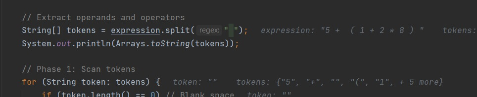

# 问题记录

## 新鲜句法

- Q: What is static blocks?

> 这个问题是我在看到`Integer.java`源码之后，才想去了解下的。看Oracle里的doc，发现全称应该是叫做`static initialization blocks`。与此同时，对应地，也有`initialization blocks`。长这样子

``` java
// they are both in a class body
static {
    // do something here
}

{
    // do something here
}
```

> 前者是在class被加载的时候被调用，而后者是instantiation的时候被调用。因此前者可以用来初始化一些final field，后者可以处理新建对象后的事情(这样就不用把field初始化之类的事情写在constructor里了)。举个例子，如下

``` java
public class Example {
    static class Foo {
        {
            String str = "instance initialization";
            System.out.println(str.toUpperCase());
        }
        static {
            String str = "static initialization";
            System.out.println(str.toUpperCase());
        }
        Foo() {
            System.out.println("CONSTRUCTOR");
        }
    }

    public static void main(String[] args) {
        Foo bar = new Foo();
        Foo bar1 = new Foo();
    }
}
/* OUTPUT
STATIC INITIALIZATION
INSTANCE INITIALIZATION
CONSTRUCTOR
INSTANCE INITIALIZATION
CONSTRUCTOR
*/
```

- Q: What is inner interface?

> 其实这个呢，我觉得就是为了更好地控制类和接口访问权限的开与闭而已。由于Interface现在默认掉（但不建议加）public和static(仅限inner interface)的关键字了。因此，inner interface就是static的了，比如我们只希望在Foo类里头使用Bar接口，我们就可以这样写。如下，如果我们不在同一个package下，就不能访问到Example里头的Bar了

``` java
class Example {
    static class Foo<T> {
        @FunctionalInterface
        interface Bar<T> {
            void accept(T t);
        }

        void doBar(Bar<T> bar, T item) {
            bar.accept(item);
        }
    }

    public static void main(String[] args) {
        new Example.Foo<String>().doBar(System.out::println, "114514");
    }
}
// 114514
```

## 未见过的行为

- Q: (泛型擦除)为什么俩type parameter不同的泛型类不一样?

> 注意这个坑，擦除是compile后擦掉的，而如`List<String>`和`List<Object>`这两个在compile的时候，是属于不同类型的。在Runtime上，它们才是属于同一类型`List`（被擦了）
>
> 因此kotlin的Array<>也不能做到jvav中`String[] a = new String[1];Object[] i = a;`的操作（

## 迷惑行为

Q: 为什么`javafx.scene.image.Image`的relative url是相对于classpath的，而`java.io.File`的path url不是？

> The Java IO API relies on the local disk file system, not on the classpath.
>
> `Java.io`的相对路径是根据此时的working directory来决定的

``` java
package test;
import java.io.File;
public class Test {
    public static void main(String[] args) {
        // Don't fiddle with relative paths in java.io.File. 
        // They are dependent on the current working directory over which you have totally no control from inside the Java code.
        File file = new File("./test.dat");
        System.out.println(file.getAbsolutePath());
    }
}
```

比如这样，的确是根据工作目录来的。

``` shell
C:\Users\situ\codes>java -cp C:\Users\situ\codes\experiment\out\production\experiment test.Test
C:\Users\situ\codes\test.dat
```

而之前使用JavaFX，要读图只能放在classpath下。之前搞不懂，是因为我不知道classpath到底是个什么鬼，而现在我懂了。

``` java
// The image is located in my.res package of the classpath
Image image2 = new Image("my/res/flower.png");
```

如果classpath是`C:\Users\situ\codes\experiment\out\production\experiment`那么这个图片的绝对路径就是`C:\Users\situ\codes\experiment\out\production\experiment\my\res\flower.png`

## Lambda

Method reference与Lambda expression的关系？详细了解Lambda表达式？为什么内部类只能访问final or effectively final的变量？

> **详情请看博客**：[点击前往](https://blog.situ2001.com/contents/3b19f30c2f96/)
>
>~~这似乎跟内部实现有关，暂时先记住这个rule吧，以后有空再去慢慢摸清。~~
>
> 简的来说，方法引用就是把一个方法当成Lambda表达式。目前我有在用，用在abstract method或者interface method的实现上。其实这个method reference在内部似乎是交给了java.util.function package里的class来处理了（这个没有深究，以后补上！）
>
> 怎么判断一个method reference能不能被使用，首先看一下这个方法，static method的话，直接看header中的return type和signature中的parameter是否一致，比如int(int, int)的抽象类或接口方法就可以接受int(int, int)的method reference。那么对于对象方法，由于this会作为第一个参数传入。一个实例方法如int(String)可以被这样的方法：int(String, String)使用，因为这个实例方法的static样子就是int(this, String)即int(String, String)
>
> constructor也可以当成reference来传的，这个我没有研究过。

## 自带API

- split()方法

竟然卡在String的split()方法里面了…不过这也证明了，我读文档的耐心程度还不够



为什么会出现一个length为0的element呢…?想了想感觉是不是：因为是空格，所以直接把空格删掉，填个""上去充数了呢。结果读了文档才发现如下这么一段

`
The array returned by this method contains each substring of this string that is terminated by another substring that matches the given expression or is terminated by the end of the string. The substrings in the array are in the order in which they occur in this string. If the expression does not match any part of the input then the resulting array has just one element, namely this string.
`

上面的这段话就是说，返回来的数组是包含着被原字符串中的子串所截断所产生的新String[]或因为没有符合的pattern而直接返回的包含一个原字符串的数组…所以，要认真一点读文档，避免错失关键信息。

## 语言律师

print一个对象不加toString()，在此之后不能用加号拼接一个非String？

> 这个有点意思，我暂时还没有想到原因。

会不会是因为当`lhs`和`rhs`都是一个没有加上`.toString()`方法的时候，就会很类似两个operand的manipulation。可能会产生歧义？（没有调查过）
