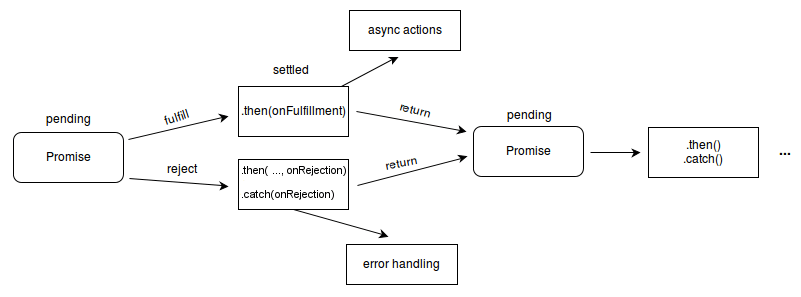
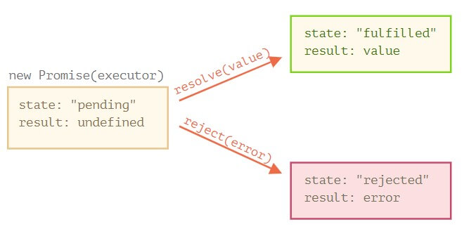

# Asynchronous

## Intro

一般代码是顺序执行的。但是，如果你的页面，要做一点时间长一点的事情(比如说网络请求，读取json等)。那么，在这些事情执行的时候，后面的语句就会在等待，此时整个页面就会冻住。直到执行完前面的语句。

一个例子就是`alert()`这个函数，在点击OK之前，后面的代码都不会被执行，这个函数可以很好地演示同步的缺点。

但是此处我们可以用异步，让这些耗时比较长的事情扔到后台执行，等执行完成后，处理callback


## Callback

回调函数就是一个函数，用来作为参数，来传给会在后台运行的函数。

> Async callbacks are functions that are specified as arguments when calling a function which will start executing code in the background.

## Implementation

js运行的主线程只有一条，但目前对于操作系统的理解不是很深刻，我只知道js是单线程非阻式的实现。

那大致是怎么样的呢？摘自MDN

> Async operations like promises are put into an event queue, which runs after the main thread has finished processing so that they do not block subsequent JavaScript code from running. The queued operations will complete as soon as possible then return their results to the JavaScript environment.

看起来要异步执行的操作，先是被存放在一个事件队列里头了，然后再在**主运行线程空闲**的时候来执行。

我们也可以用一段代码来试一下，可以在循环`console.log()`输出114514次一个变量，然后设置一个3秒的`setTimeout()`来输出hello world

```javascript
setTimeout(() => console.log("Hello world"), 3000);
for (var i = 0; i < 114514; i++) { console.log(i) }
```

理论上三秒就能执行输出hello world了，但是等了十多秒，也就是for循环结束之后才输出。（这就是在主线程空闲时再执行）

```shell
114512
114513
Hello world
```

异步的任务是用线程池里头的后台线程来handle的。整个过程如图所示


## Promise

Promise都是异步的，这是ES2015引进来的新东西

> In essence, it's the browser's way of saying "I promise to get back to you with the answer as soon as I can," hence the name "promise."

Promise表示一个操作的中间状态，可以handle一个在未来才已知的量，在未来这个未知的量变为已知之后，就可以处理它了。

### Stage

Promise对象有三种状态: pending, fulfilled 和 rejected

- pending: initial state, neither fulfilled nor rejected.
- fulfilled: meaning that the operation was completed successfully.
- rejected: meaning that the operation failed.



由于方法`then()`与`catch()`与`finally()`都返回一个Promise，这个Promise的result呢...只有`then()`能更改Promise对象的resolved value。因此Promise可以被链式调用。像这样

```javascript
const calc = new Promise((resolve, reject) => {
    resolve(4);
}).then(val => val ** 2)
  .then(val => val ** 2)
  .then(val => val ** 2)
  .then(val => console.log(val)); // 65536
```

其中，`then()`中的参数`onRejection`是可选的，error也可以由`catch(onRejection)`来handle

### Instantiation

```javascript
let promise = new Promise(function(resolve, reject) {
  // the function is executed automatically when the promise is constructed

  // after 1 second signal that the job is done with the result "done"
  setTimeout(() => resolve("done"), 1000);
  // or done with the result "error"
  // setTimeout(() => reject("error", 1000));
});
```

当Promise对象得到结果之后，必是下面两者之一

- `resolve(value)` — if the job finished successfully, with result `value`.
- `reject(error)` — if an error occurred, error is the error `object`.



### Examples

由于Promise保证了是异步，因此就算是看起来可以马上被执行的函数，也只会在栈空了、过了一个clock-tick之后被执行

```javascript
const promiseA = new Promise( (resolutionFunc,rejectionFunc) => {
    resolutionFunc(777);
});
// At this point, "promiseA" is already settled.
promiseA.then( (val) => console.log("asynchronous logging has val:",val) );
console.log("immediate logging");

// produces output in this order:
// immediate logging
// asynchronous logging has val: 777
```

---

- 与callback的区别

> Promises have some similarities to old-style callbacks. **They are essentially a returned object to which you attach callback functions, rather than having to pass callbacks into a function.**

它们本质都是一个返回的对象，我们可以将回调函数附加到该对象上，而不必将回调作为参数传递给另一个函数。

---

### async

加`async`的函数，就会是一个Promise-based function，返回值就会是一个Promise

```javascript
let hello = async function() { return "Hello" };
hello(); // Promise {<fulfilled>: "hello"}
hello().then((value) => console.log(value)); // hello
```

### await

> The await operator is used to wait for a Promise

```javascript
[rv] = await expression;
// rv: Returns the fulfilled value of the promise, or the value itself if it's not a Promise.
// expression: A Promise or any value to wait for.
```

在Promise-based的函数调用前，加await，可以让code暂时停下，直到这个promise被fulfill，并返回结果的值，**而不是Promise**

```javascript
// a function that returns a Promise
function resolveAfter2Seconds(x) {
  return new Promise(resolve => {
    setTimeout(() => {
      resolve(x);
    }, 2000);
  });
}

async function f1() {
  // works only inside async functions
  var x = await resolveAfter2Seconds(10);
  console.log(x); // 10
}

f1();
```

而如果把await去掉,就会打印出 `Promise {<pending>}`

```javascript
var x = resolveAfter2Seconds(10); // await was removed
```

还可以直接get到thenable对象的值...thenable可以是一个对象，但是这个对象里头有`then`函数，并且函数的样子长得很像一个Promise的话。那`await`就会把它当成一个Promise。

一般可以用来做自定义

```javascript
let show = v => console.log(v);

class Thenable {
  constructor(num) {
    this.num = num;
  }
  then(resolve, reject) {
    show(resolve); // [Function (anonymous)]
    setTimeout(() => resolve(this.num * 2), 1000); // 8
  }
}

new Promise(resolve => resolve(4))
  .then(result => {
    return new Thenable(result); // 4
  })
  .then(show); // shows 2 after 1000ms
```

`await`还可以把`reject()`的给catch住，不过暂时还不知道有什么用...

```javascript
let f = async () => {
  try {
      let x = await Promise.reject(4);
  } catch(e) {
      console.log(114514)
  }
};

f(); // 114514
```
