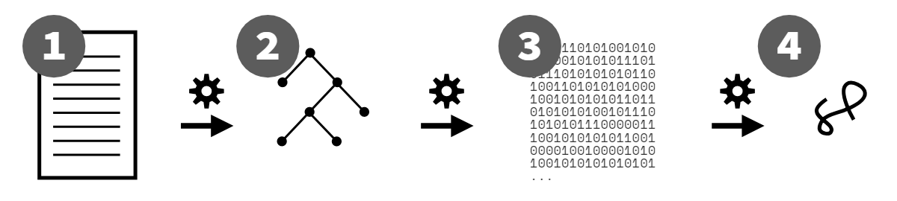

# Background

一些背景知识

## ES

> ES -- The abbreviation of ECMAScript
>
> ECMA -- European Computer Manufacturers Association

ES6也叫做ES2015，是ES中的一个新版本，是现在JS的下一个迭代版本了，加入了许多的新特性。是在2015年出来的，当然现在还在不断更新着（命名方式是以年为后缀：ES2016 2017...）

## JavaScript

> JS's syntax and behavior are defined in the ES specification.

JavaScript是ECMAScript的一个实现，具体syntax与行为，都定义在ES spec里了:[https://www.ecma-international.org/publications-and-standards/standards/ecma-262/](https://www.ecma-international.org/publications-and-standards/standards/ecma-262/)

而ECMAScript standard由TC39 committee来指导

> Their primary task is managing the official specification for the language. They meet regularly to vote on any agreed changes, which they then submit to ECMA, the standards organization.

TS39的一些proposal都可以在这里找到: [https://github.com/tc39/proposals](https://github.com/tc39/proposals)

JS可以运行在Browsers里头，也可以在其他environment上运行，比如Node.js

### 一些方法的命名

是`Array.prototype.includes`而不是`Array.prototype.contains`，又如是`Array.prototype.flat`而不是`Array.prototype.flatten`。是因为有一些第三库有这样的方法，所以为了不破坏现有网页内容，TS39就这样命名了。可以参见smoosh门事件

### 几个JS

> Contrary to some established and frustratingly perpetuated myth, there are not multiple versions of JavaScript in the wild. There's just **one JS**, the official standard as maintained by TC39 and ECMA.

就一个...真的就只有一个JS啊...

在浏览器上面呢？

Web browser上面的，包含了JS+DOM+BOM。

不同环境下（比如浏览器，nodejs）的JS加了一些自己的API进去，就比如`alert()`和`console.log`和`console.*`，又或者`fs.write()`（来自nodejs的built-in module）这些方法，其实是没有在JS官方spec里头定义的。

哦还有console只是为了方便做点调试而已。不要完全相信在F12 console里面出现的行为啊。

> Don't trust what behavior you see in a developer console as representing exact to-the-letter JS semantics; for that, read the specification. Instead, think of the console as a "JS-friendly" environment. That's useful in its own right.

### Paradigm

> Paradigm is a board mindset and approach to structuring the codes

JS是一门多范式语言，其代码可以由以下几个范式混编

1. Procedural style
2. OO style
3. FP style

### 解释or编译

JS到底是解释性语言呢还是编译性语言呢？解释性语言执行的时候会一行一行地运行，碰到错误就会停止。比如，第十行的错误不会在执行到它的时候抛出。

不像一些动态语言如Python。JS是一门**编译性语言**。这样做可以提高执行的效率，也可以在执行前就能detect到大多数error

编译的大致过程如下



1. 代码经过Babel之类的transpiler和Webpack这些打包工具（或者不经过），产生的代码交给JS引擎
2. JS引擎将这些代码转化为AST(Abstract Syntax Tree)
3. 引擎将AST转化为byte code，然后再被JIT(Just-In-Time) compiler优化/转化
4. JS VM执行这些byte code

## Backward compatible

这意味着就一旦一个特性被定下后，以后就不会被移除了，以确保老旧的代码能在最新引擎中跑起来。

与之相反的是Forward Compatible，就像是HTML和CSS那样——加了新特性，但是代码却能在老版本浏览器中跑，那是因为新特性被忽略了，只处理该浏览器版本支持的特性（

JS本身不支持这个，这意味着新的syntax和新的API不能在旧版本的引擎上面跑。

---

### BabelJS

虽然JS不支持Forward Compatible，但是我们写的含新syntax的代码依旧能在浏览器上面跑

举个例子：由于ES5还在浏览器上面使用，因此BabelJS用来作为在浏览器中ES5与ES2015之间转换的桥梁(ES2015 to ES5)。所以你可以在浏览器上面愉悦地使用ES2015，实际上就是通过BabelJS将ES2015的代码转换到了ES5

对于这种转化，我们称之为transpiling。Babel就是一个transpiler，用来将新ES标准的syntax，转化为等效的老syntax

### polyfill

那一些新的API怎么办呢？怎么使这些代码能有前置兼容性呢？那就检查是否有这个API，没有的话就直接定义一个咯，这就是polyfill

比如ES2019才加入的`Promise.prototype.finally`，它的一个简单的polyfill的就像是下面这样的(摘自YDKJSY)

```javascript
if (!Promise.prototype.finally) {
    Promise.prototype.finally = function f(fn){
        return this.then(
            function t(v){
                return Promise.resolve( fn() )
                    .then(function t(){
                        return v;
                    });
            },
            function c(e){
                return Promise.resolve( fn() )
                    .then(function t(){
                        throw e;
                    });
            }
        );
    };
}
```

## WASM

> Web Assembly

简略记录。大致的，就是将其他语言写的代码转化为ASM.js，从而使得代码能够在JS引擎上面跑。
