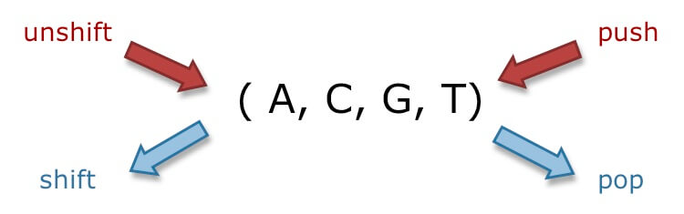

# Built-in Objects

## String

### Retrieve a char

``` javascript
let str = 'dssq';
console.log(str[2]); // s
```

### indexOf

Return the starting position of the substring in a string. If the substring is not found in the string, `-1` will be returned.

``` javascript
let str = 'situ2001';
let index = str.indexOf('2001'); // 4
```

### slice

把substring切出来，但是要注意是，左闭右开：`(inclusive, exclusive)`

``` javascript
let str = 'situ2001';
let substring = str.slice(0,4); // situ
let substring1 = str.slice(4); // 2001
```

## 大小写

方法名都一样: `toLowerCase` and `toUpperCase`

### replace

Do replacement and return a new string.

``` javascript
let str = 'situ2001';
str.replace('2001', '2021'); // replace 2001 with 2021, result: situ2021
```

也可以`replace(regex, str)`

### To Arrays

Just use the method `split`

``` javascript
let myData = 'Manchester,London,Liverpool,Birmingham,Leeds,Carlisle';
let myArray = myData.split(',');
// ["Manchester", "London", "Liverpool", "Birmingham", "Leeds", "Carlisle"]
```

## Arrays

### 添加删除元素



``` javascript
let a = [23, 45, 12, 67];
a.unshift(34);
console.log(a); // [34, 23, 45, 12, 67]
```

## Number

将字符串等转换为数字

``` javascript
let i = '114514';
i = Number(i);
```

弱类型: `1 / 2 = 0.5`，而不是`1`

### toFixed

固定小数位位数

``` javascript
let lotsOfDecimal = 1.766584958675746364;
lotsOfDecimal;
let twoDecimalPlaces = lotsOfDecimal.toFixed(2);
twoDecimalPlaces;
```

## Set

集合，很常见的。不过特殊的是，js里头的集合，可以装primitive和object

> Set objects are collections of values. You can iterate through the elements of a set in insertion order. A value in the Set may only occur once; it is unique in the Set's collection.

## WeakSet

`weak`在哪里呢？

> The WeakSet is weak, meaning references to objects in a WeakSet are held weakly.

这意味着只能存object，一但里面存放的对象没有被任何一个引用变量所引用，那么它就会被垃圾回收掉。
