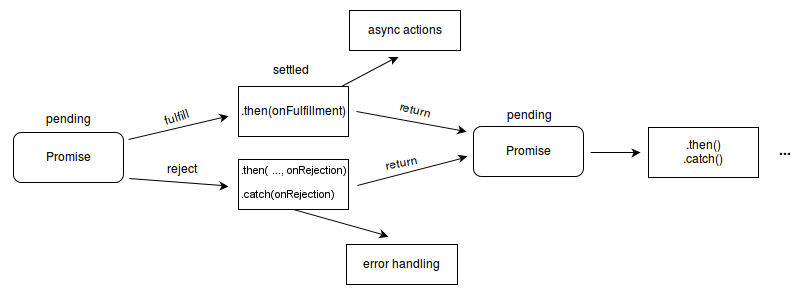
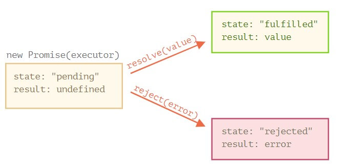

# Promise

Promise都是异步的，这是ES6引进来的新东西

> In essence, it's the browser's way of saying "I promise to get back to you with the answer as soon as I can," hence the name "promise."

Essentially, a Promise is an object that represents an intermediate state of an operation — in effect, a promise that a result of some kind will be returned at some point in the future. There is no guarantee of exactly when the operation will complete and the result will be returned, but there is a guarantee that when the result is available, or the promise fails, the code you provide will be executed in order to do something else with a successful result, or to gracefully handle a failure case.

可以handle一个在未来才已知的量，在未来这个未知的量变为已知之后，就可以接着处理它了。

## Stage

- pending: initial state, neither fulfilled nor rejected.
- fulfilled: meaning that the operation was completed successfully.
- rejected: meaning that the operation failed.



由于方法`then()`与`catch()`都return一个Promise，因此Promise可以被链式调用。

由图可看，then(.., onRejection)是可选的，error也可以由`catch(onRejection)`来handle

## Instantiation

``` javascript
let promise = new Promise(function(resolve, reject) {
  // the function is executed automatically when the promise is constructed

  // after 1 second signal that the job is done with the result "done"
  setTimeout(() => resolve("done"), 1000);
  // or done with the result "error"
  // setTimeout(() => reject("error", 1000));
});
```

> When the executor obtains the result, be it soon or late, doesn’t matter, it should call `one of these` callbacks:

- resolve(value) — if the job finished successfully, with result `value`.
- reject(error) — if an error occurred, error is the error `object`.



## Example

``` javascript
const myPromise = new Promise((resolve, reject) => {
  setTimeout(() => {
    resolve('foo');
  }, 300);
});

myPromise
  .then(handleResolvedA, handleRejectedA)
  .then(handleResolvedB, handleRejectedB)
  .then(handleResolvedC, handleRejectedC);
```

由于Promise保证了是异步，因此就算是看起来可以马上被执行的函数，也会在栈空了且过了一个clock-tick之后才会被执行

``` javascript
const promiseA = new Promise( (resolutionFunc,rejectionFunc) => {
    resolutionFunc(777);
});
// At this point, "promiseA" is already settled.
promiseA.then( (val) => console.log("asynchronous logging has val:",val) );
console.log("immediate logging");

// produces output in this order:
// immediate logging
// asynchronous logging has val: 777
```

## Difference

> Promises have some similarities to old-style callbacks. **They are essentially a returned object to which you attach callback functions, rather than having to pass callbacks into a function.**

它们本质上是一个返回的对象，您可以将回调函数附加到该对象上，而不必将回调作为参数传递给另一个函数。

## Keyword

有了上面的铺垫，现在引出关键字`async`与`await`

### async

加`async`的函数，就会是一个Promise-based function，返回值就会是一个Promise

``` javascript
let hello = async function() { return "Hello" };
hello(); // Promise {<fulfilled>: "hello"}
hello().then((value) => console.log(value)); // hello
```

### await

接着，与上者配合的就是`await`了，它**只能**用在async函数里头

await only works inside async functions within regular JavaScript code.

在Promise-based的函数前加await，可以让code暂时停下，直到这个函数执行完毕。相当这个异步函数的内部执行是同步的

await can be put in front of any async promise-based function to pause your code on that line until the promise fulfills, then return the resulting value.

``` javascript
// an asynchronous function(returning a Promise)
function resolveAfter2Seconds(x) {
  return new Promise(resolve => {
    setTimeout(() => {
      resolve(x);
    }, 2000);
  });
}

async function f1() {
  // works only inside async functions
  var x = await resolveAfter2Seconds(10);
  console.log(x); // 10
}

f1();
```

而如果把await去掉

``` javascript
var x = resolveAfter2Seconds(10); // await was removed
```

就会打印出 `Promise {<pending>}`
