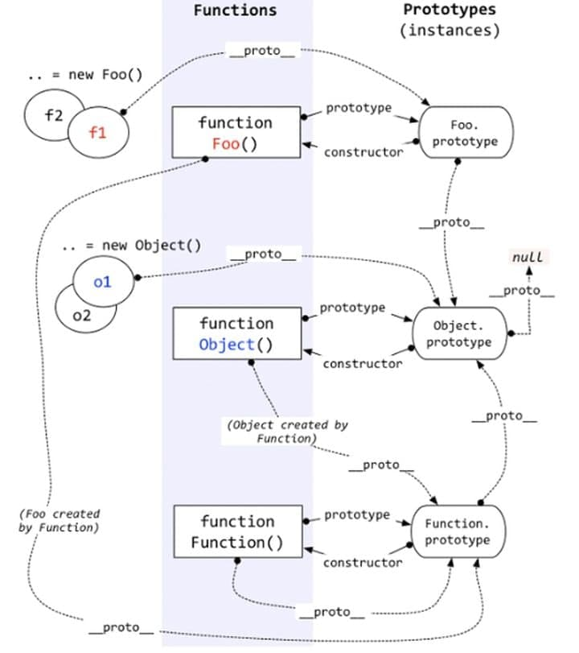

# JS之按步学习

说明，这里记录的是有关于JavaScript的按步学习的笔记，我学JS的主要来源为:OOP的思想+神书《JavaScript: The Good Parts》

在前面，关于如何理解函数的prototype和隐式property `__proto__`，我得贴一张好图了


## Function

说起函数这个东西啊，在其他语言里头，函数不是怎么惹人注目，是函数就是函数，作为函数或者方法，就这样用起来了。但是在JS里头，函数却是优等公民，函数被当做对象来处理了，说起这个，第一次就可以想到，Function都拥有着他们自己的methods。

函数在JS里头的地位实在是太过重要了，Function可以有四种Patterns，如下

1. The method invocation pattern
2. The function invocation pattern
3. The constructor invocation pattern
4. The apply invocation pattern

其实可以类比一下嘛（

1. Java里的instance method
2. Java里的static method
3. Java里的constructor（注意有不同）
4. 目前我只见到JS有（Java8后的Lambda中的apply()方法？

## Closure

中文就是闭包嘛，其实实际上的就是：一小块的代码块。在js中，由于context的存在，因此外部的可以被捕获进closure与之形成闭包。《The good parts》里面也有一句话说了

> This is possible because the function has the access to the context in which it was created.

我们看点实例代码就懂了

``` javascript
/** example code for explaining closure */

/** 
 * The function has access to the context in which it was created. This is called closure
 * And it has privileged access to the property even the method returned
*/

//like these
//example 1
var myObject = function () {
    var value = 0;

    return {
        increment: function (inc) {
            value += typeof inc === 'number' ? inc : 1;
        },
        getValue: function () {
            return value;
        }
    };
}();
myObject.increment(114514);
console.log(myObject.getValue()); // 114514

//example 2
var quo = function (status) {
    return {
        get_status: function () {
            return status;
        }
    };
};
var myQuo = quo('amazed');
console.log(myQuo.get_status());

//So, how to set events for each button?

//a bad example. When a button was clicked, it alerts the length of the array of the nodes but not the ordinate.
var add_the_handlers_bad = function (node) {
    var i;
    for (i = 0; i < nodes.length; i += 1) {
        nodes[i].onclick = function (e) {
            alert(i);
        };
    }
};

//a better example. While setting an event of a button, the i will be passed into the function
//and the events will be handled by a function that return from a function.
var add_the_handlers = function (nodes) {
    var i;
    for (i = 0; i < nodes.length; i += 1) {
        nodes[i].onclick = function (i) {
            return function (e) {
                alert(i);
            };
        }(i);
    }
};
```

代码虽然不是很多，但是能清晰地诠释了JavaScript中的闭包（我觉得比groovy的闭包简单多了

## keyword this

`this`这个关键字可常见了，在JavaScript中大概就是执行当前语句时的对象吧。（个人理解）在MDN里头呢，解释是这样的（差不多，但是跟个人理解输出的句子不拗口多了）

> In most cases, the value of this is determined by how a function is called (runtime binding). It can't be set by assignment during execution, and it may be different each time the function is called.

大多数情况就是用来查明这个函数是由谁call的，但是要注意两种情况（我目前碰到的）

1. The constructor invocation pattern
2. Arrow function

前者就是要注意，pattern都不同了。后者就要注意没有argument和this的这个问题了。前后者都可以capture外部的this，但是前者可以作为constructor invocation pattern来使用，用于新建对象。
