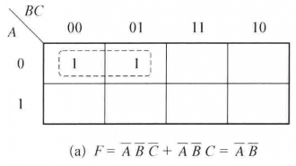

# 数字电路

(Discontinued)2020-03-29,该栏目转移到个人notion上

这是数字电路课的笔记。(目前来看，怎么有一种离散数学的味道)

## 基础储备

### 运算符号

基本的单个符号(与或非)，而由这三者其中几个组合而成的就是复合逻辑的符号。

其实这些符号跟离散数学的很相似，也下表所示。

|符号名称|数字电路|离散数学|
|--|--|--|
|与|$\cdot$|$\land$|
|或|+|$\lor$|
|非|`|$\neg$|
|异或|$\oplus$|
|同或|$\odot$|
|与非|
|或非|

### 原码 补码 反码

### 一些运算律

我是个省纸的人，所以我就直接扔到离散数学那边去了。

德摩根定理：常用的是用来将非门化掉的，比如下

$\neg(A\lor B)=\neg A\land\neg B$

$\neg (A\land B)=\neg A\lor\neg B$

## 逻辑代数

很多知识都是离散数学的，迁移运用一下就行了。

### 逻辑函数

原理跟正常的函数也没有什么不同，功能都是处理(映射)输入的数据后输出结果。要我说，最暴力的方法依旧还是**真值表**。逻辑函数，这个东东似乎是在逻辑图、波形图、卡诺图等等的地方使用。（重要的是真值表和逻辑式和逻辑图，不过这不是离散数学的内容吗...

提到的有下面几种

1. 真值表
2. 逻辑式
3. 逻辑表
4. 卡诺图
5. 波形图

真值表yyds，自己水平菜的不行的时候，万能工具就是真值表啦。逻辑式，就是字母公式啦，很像是命题公式。然后逻辑图就是用与或非门做出来的电路图，就是逻辑图了。波形图，我个人理解，就是电平图，通过读取在某一段时间内的电平高低来判断0还是1。再接着卡诺图，就是画格子，有点像高中生物的遗传图表，使之来说呢，跟真值表没啥不同，就是减少一下穷举的次数，同时也能在表里执行化简而已。

---

- 最小项之和与最大项之积（等等，这货好像离散数学的那个内容，待补全

最小项有多少个？就是$2^n$个嘛，比如$ABC$就算是一个最小项了，记作$m_1$，然后对于任意一个最小项，三个变元只有一种取值组合才能让这个最小项取值为1。同理我们可以迅速得出，最大项也只有$2^n$个，但是由个个之间的**取和变为了取或**(由合取conjunction变成了析取disjunction)，比如$A+B+C$是一个最大项，记作$M_1$

一些公式，利用$A+A`=1$这个运算性质可以将任何一个逻辑函数转化为最小项之和的形式，比如$BC=BC(A+A`)=ABC+A`BC=\sum m(6,7)$

据老师说，这是用来给化简(卡诺图)来做铺垫的？

---

- 卡诺图化简的原理

的确，就是逆着利用$A+\overline{A}=1$罢了，就像是$A\overline{B}+AB=A$

比如，化简逻辑函数F,其中$F(A,B,C,D)=\sum m(1,5,6,7,11,12,13,15)$，然后就会发现相邻的可以合成一个项，比如$AB\overline{CD}+AB\overline{C}D=AB\overline{C}$

---

Q: 相邻的项合并方法是是?

A: 如图所示，在合并项(卡诺圈)所处位置上，若某变量的代码有0也有1，则该变量被消去，否则该变量被保留，并按0为反变量，1为原变量的原则写成乘积项形式的合并项中。
